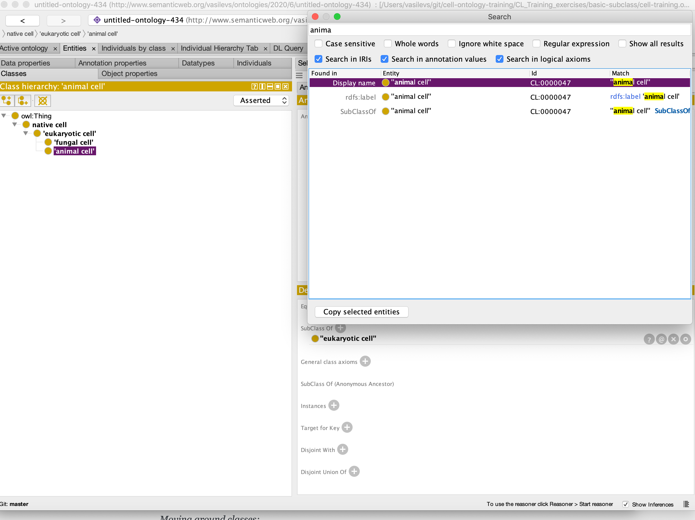

# EXERCISE: Basic Subclass Hierarchy

Go to the directory basic-subclass in the CL_Training_execises folder and open /basic-subclass/cell-training.owl.

This example illustrates adding classes and class annotations into an existing Subclass hierarchy.

_Note: This example does not make use of reasoning / automated classification or class expressions._

Constructs illustrated:

 - Adding subclasses
 - Adding annotations to classes
 - Adding DatabaseCrossReferences (xref) classes

**Instructions:**

_Add Subclass_
1. Open cell-training.owl and navigate to the Entities tab.
2. Add the class 'bone cell' to the ontology as a subclass of 'animal cell'. (Don't worry about the ID.) _Note: Most ontologies use lowercase labels, except for proper names._
    
    a. To find the class 'animal cell', you can navigate through the hierarchy, or use the search function, see screenshot below. Make sure you select "Show all results". In the search results, double click on the highlighted class and it will open it up in the Class hierarchy pane.

_Moving around classes:_

3. Add the term 'epithelial cell' as a subclass of "Thing"
4. Move it, by dragging and dropping, to place it as a subclass of 'animal cell'.

Your hierarchy should look something like this:

_Annotations_

The goal is to recreate the existing information from CL on the 'epithelial cell' class.

5. Click on the 'epithelial cell' class you just created.
6. In the Annotations pane on the right, use the (+) next to 'Annotations' to add an annotation.

You will add the annotation values listed are below, detailed instructions follow. Make sure you click on the correct annotation on the left for each annotation.

**id:** CL\_0000066

**rdfs: label:** 'epithelial cell'

**definition:** A cell that is usually found in a two-dimensional sheet with a free surface. The cell has a cytoskeleton that allows for tight cell to cell contact and for cell polarity where apical part is directed towards the lumen and the basal part to the basal lamina.
**database\_cross\_reference:** FB:ma
**database\_cross\_reference:** GOC:tfm
**database\_cross\_reference:** MESH:A11.436
(Note- the dbxefs above should go on the definition)

**has\_exact\_synonym:** repitheliocyte

**database_cross_reference:** BTO:0000414
**database_cross_reference:** CALOHA:TS-2026
**database_cross_reference:** CARO:0000077
**database_cross_reference:** FBbt:00000124
**database_cross_reference:** FMA:66768
**database_cross_reference:** WBbt:0003672

## The Class description view

We have seen how to add sub/superclasses and annotate the class hierarchy. Another way to do the same thing is via the Class description view (circled in the figure below). When an OWL class is selected in the entities view, the right-hand side of the tab shows the class description panel. If we select the **'smooth muscle cell'** class, we see in the class description view that this class is a "SubClass Of" (= has a _SuperClass_) the **'non-striated muscle cell'** class. Using the (+) button beside "SubClass Of" we could add another superclass to the ''smooth muscle cell'' class.

# STOPPED HERE

Select the **intracellular organelle part** class in your ontology. Notice it is a SubClass of **organelle part.** Using the SubClass Of (+) button, add the **organelle** class as a super class. There are various ways to assert a superclass. The simplest it to just type in the class expression editor. _Hint: Pressing Tab (or CTRL + SPACE on a Mac) allows you to autocomplete on a term._

You can also use the class hierarchy tab here to search, browse and select the appropriate class.

The **intracellular organelle part** class will now have two parents asserted in the class hierarchy. You will also be able to see both parents in the class description view.

Save your interim ontology to your computer. _Note: You will use this same file in the next section: Disjointness._
