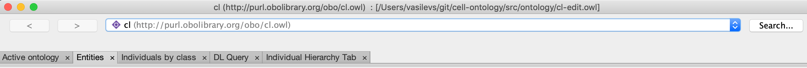
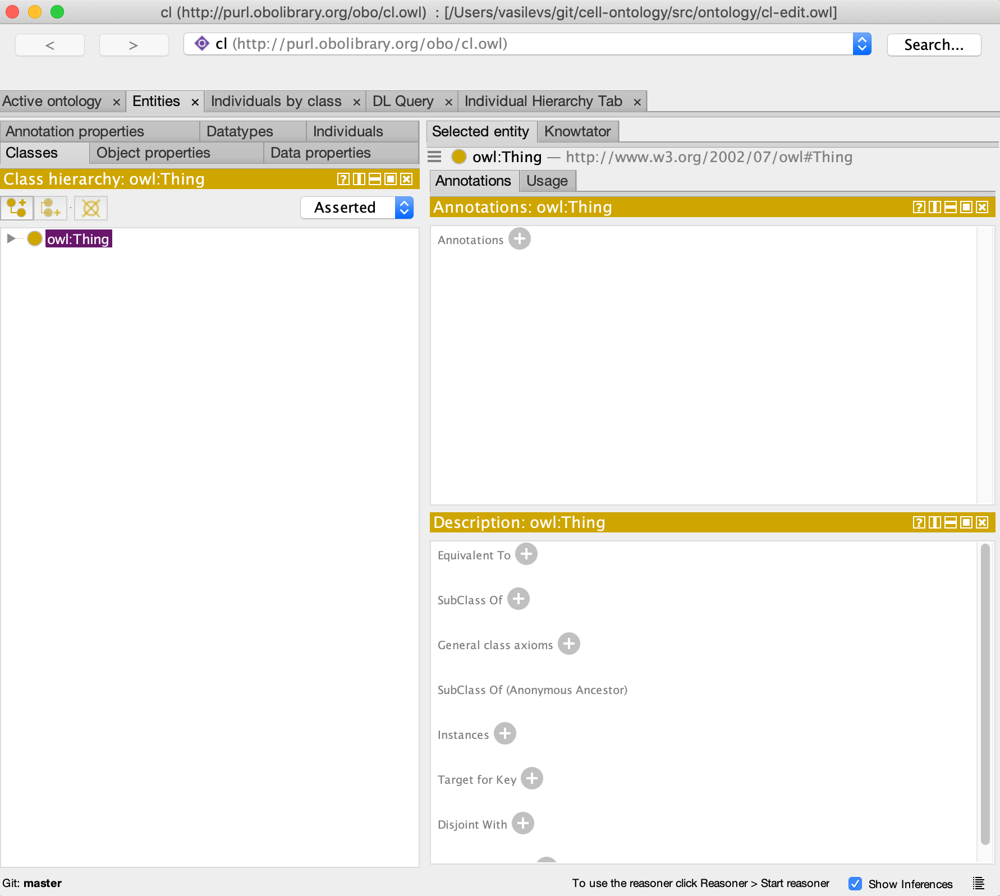
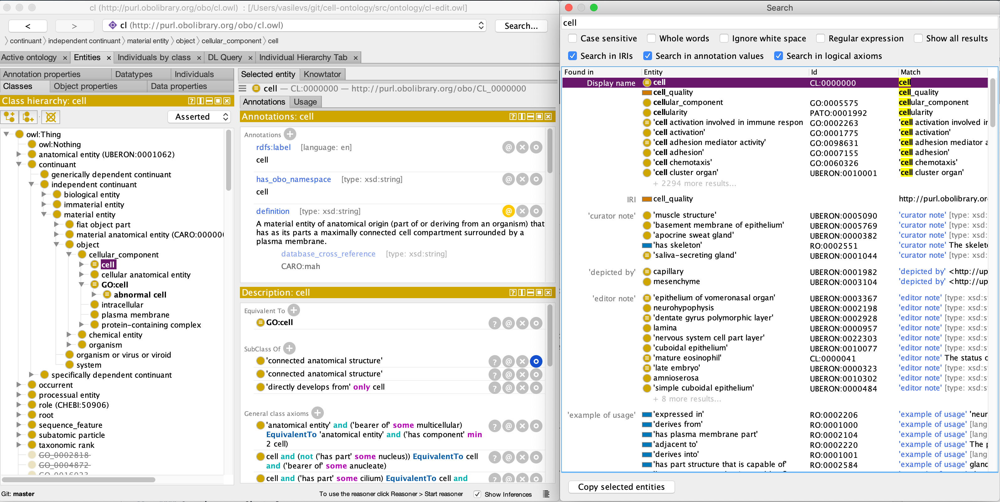
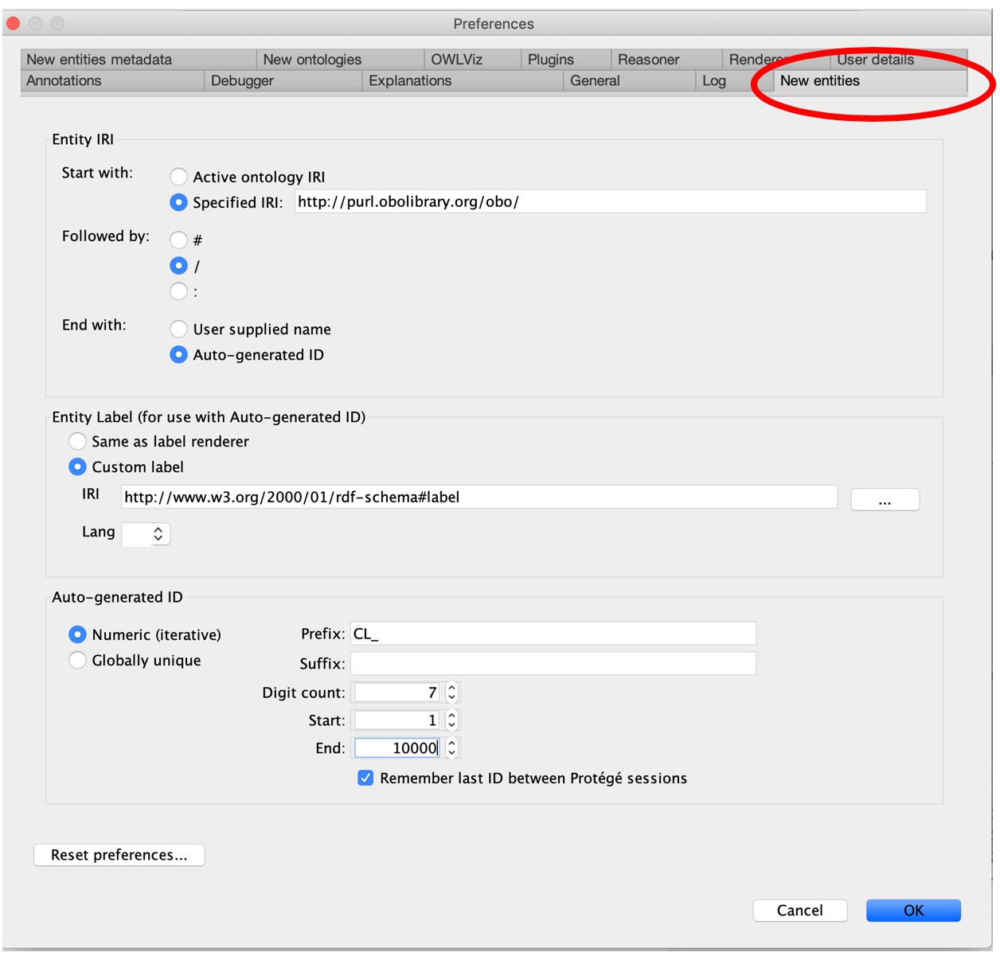
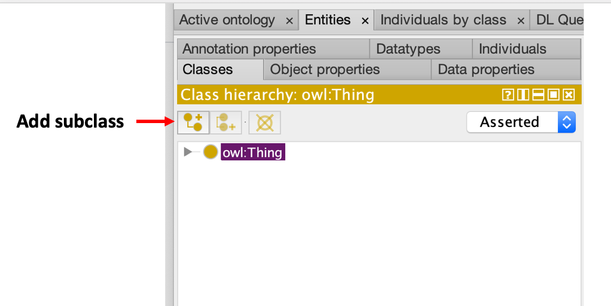
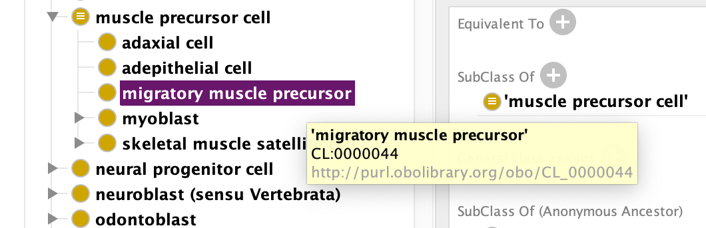
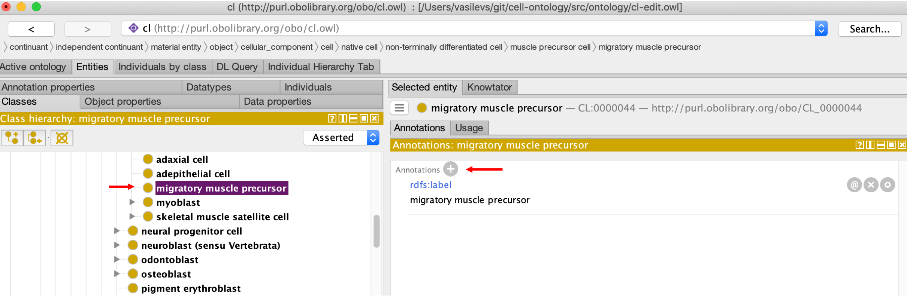
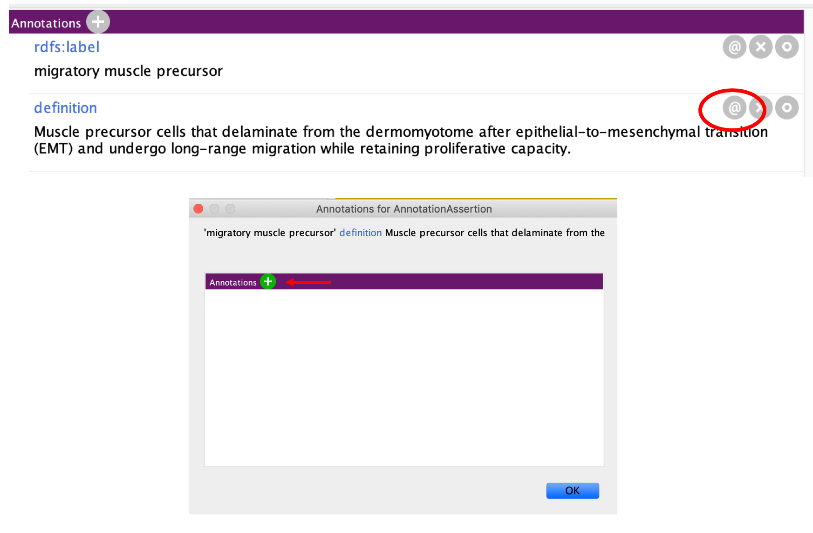
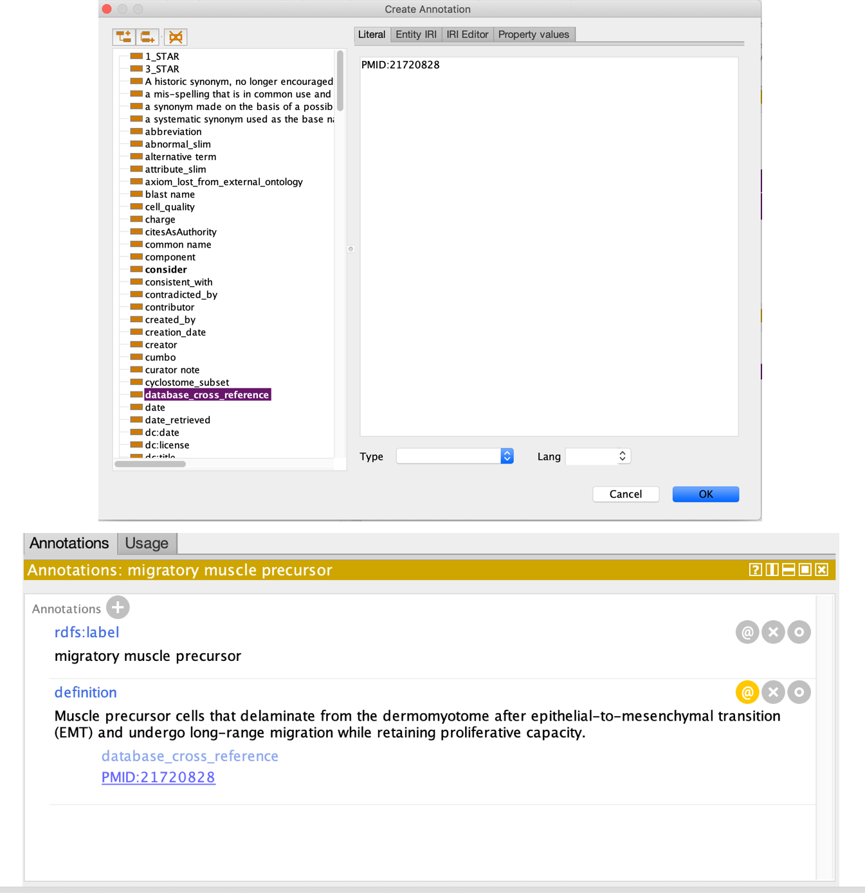

### Entities tab

You will see along the top of the screen various tabs. Each tab provides a different perspective on the ontology. An entity is any class, property (object, data, or annotation), or individual. For example, the classes tab allows us to view and edit the classes in the ontology, and similarly the object properties tab focuses on the object properties in the ontology. The _primary tab_ where you will spend most of your time is the Entities tab.

Select the Entities tab and then select the Thing class. Thing is the root class for all OWL ontologies and it cannot be deleted in Protégé. Click the arrow next to Thing to expand the hierarchy. In the cl-edit.owl file, you will see upper level BFO classes and some imported ontology upper level classes (like anatomical entity from UBERON and role from CHEBI).

The Entities tab is split into two halves. The left-hand side provides a suite of panels for selecting various entities in your ontology. When a particular entity is selected the panels on the right-hand side display information about that entity. The entities panel is context specific, so if you have a class selected (like Thing) then the panels on the right are aimed at editing classes. The panels on the right are customizable. Based on prior use you may see new panes or alternate arrangements.

#### Searching in Protege

You can navigate through the hierarchy to find the top level 'cell' class (* described below), or search for the class using the search bar on the right. The search window will open on top of your Protege pane, we recommend resizing it and moving the two panes side by side.

* 'cell' is classified under continuant -> 'independent continuant' -> 'material entity' -> object -> cellular_component -> cell

#### Setting Preferences for New entities

Ontology terms have separate names and IDs. The names are annotation values (labels) and the IDs are represented using IRIs. The OBO foundry has a policy on IRI (or ID) generation (http://www.obofoundry.org/principles/fp-003-uris.html). You can set an ID strategy using the “New Entities” tab under the Protégé Preferences – on the top tool bar, click the “Protégé dropdown, then click Preferences.

Set your new entity preferences as in the following screenshot in the New Entities tab:

Note - if you edit more than one ontology in Protege, you will need to update your Preferences for each ontology before you edit. 

Note that all OBO library ontologies should use the “Specified URI” value: http://purl.obolibrary.org/obo

#### Creating a new class

New classes are created in the **Class hierarchy panel on the left.**

There are three buttons at the top of the class hierarchy view. These allow you to add a **subclass (L-shaped icon)**, **add a sibling class (c-shaped icon)**, or **delete a selected class (x’d circle)**. 

Practice adding a new term: 
- Search for the term 'muscle precursor cell'. 
- When you aare clicked on the term in the Class hierarchy pane, click the add subclass button to add a child class to 'muscle precursor cell'. 

A dialog will popup. Name this new subclass **migratory muscle precursor**.  Click “OK” to add the class.

By default, Protégé will use the ontology IRI, followed by a #, followed by your specified name (replacing spaces with underscores) as the unique IRI for this entity. If you hover over this class with your mouse you will see the full IRI for this class.

#### Adding annotations properties

Using Protégé you can add annotations such as labels, definitions, synonyms, database cross references (dbxrefs) to any OWL entity. The panel on the right, named Annotations, is where these annotations are added. CL includes a pre-declared set of annotation properties. The most commonly used annotations are:
- rdfs:label
- definition
- has_exact_synonym
- has_broad_synonym
- has_narrow_synonym
- has_related synonym
- database_cross_reference
- rdfs:comment

Use this panel to add a definition to the class you created. Select the + button to add an annotation to the selected entity. Click on the annotation 'definition' on the left and copy and paste in the definition to the white editing box on the right. Click OK. 

Definition: Muscle precursor cells that delaminate from the dermomyotome after epithelial-to-mesenchymal transition (EMT) and undergo long-range migration while retaining proliferative capacity.

Definitions in CL should have a 'database cross reference' (dbxref), which is a reference to the definition source, such as a paper from the primary literature or another databse. For references to papers, we cross reference the PubMed Identfier in the format, PMID:XXXXXXXX.

To add a dbxref to the definition:
- click the @ symbol next to the definition
- click the + button next in the pop-up window
- Scroll up on the left hand side until you find 'database_cross_reference', and click it
- Add the PMID in the editing box (PMID:21720828). _Note: the PMID should not have any spaces)
- Click OK twice
- The dbxref should appear as below.

